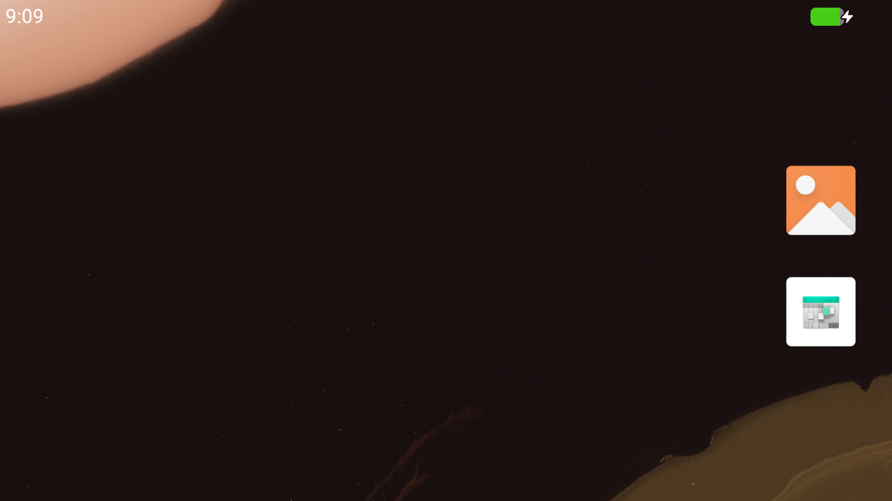

# Multiemu

An Android emulator for macOS. Native Swift and SwiftUI over an isolated,
replaceable virtualization backend — no Electron, no bundled Java, no
third-party Swift dependencies.



*Android 17 on an Apple Silicon Mac. That screenshot is taken from the running
guest by the app itself, and the keyguard in it was swiped away through the
emulator's own input path.*

## Where it is

Android 17 boots to the launcher in about **3.7 seconds** under
Hypervisor.framework and runs at **37–39 FPS** under a scripted workload. It is
usable, and it is not finished. What that means concretely:

| | |
| --- | --- |
| **Boots Android** | ✅ 3.7 s cold boot; first boot of a new device takes a few minutes for `dex2oat` |
| **Screen, mouse, keyboard** | ✅ Metal-rendered; the mouse is delivered to the guest as a finger, verified by opening an app from a tap |
| **ADB** | ✅ a first-party client, implemented here — Google's `adb` is not redistributable |
| **Install APKs** | ✅ drag one onto the window, or `Device ▸ Install APK…` |
| **Move files** | ✅ both directions, byte-exact, over the ADB sync protocol |
| **Snapshots, multi-instance** | ✅ RAM and disk, several devices at once |
| **Audio** | ⚠️ output reaches the host at the ALSA layer, but **apps are silent** — the AOSP images available today route audio to a stub driver |
| **Clipboard** | ❌ Android refuses clipboard access to anything that is not the foreground app |
| **Microphone** | ❌ no capture path exists on this host/guest pair |
| **Signed builds** | ❌ ships unsigned, by choice — see [Installing](#installing) |

[docs/ROADMAP.md](docs/ROADMAP.md) records what every milestone achieved and,
where something is partial, exactly what blocks it.
[docs/VERIFY.md](docs/VERIFY.md) is the evidence log — including the wrong turns
and how they were caught.

## Requirements

| Item | Requirement |
| --- | --- |
| Host OS | macOS 14.0 or later |
| Host CPU | Apple Silicon (arm64) or Intel (x86_64) |
| Toolchain (to build) | Xcode 15.3+ / Swift 5.10+ (developed against Xcode 26.6 / Swift 6.3) |
| Guest | Android 9 (API 28) or later |

## Installing

Multiemu ships **unsigned**, so macOS refuses it on first launch. That is
expected — there is no Apple Developer membership behind this project and it is
not notarized. After dragging the app out of the disk image:

```bash
xattr -d com.apple.quarantine /Applications/Multiemu.app
```

or right-click the app and choose **Open**, which offers the same override
through the interface.

Prefer not to do either? Build it yourself — same application, no credentials
needed:

```bash
git clone https://github.com/smoker070/multiemu.git
cd multiemu
swift build && swift test
scripts/build-app.sh
open build/Multiemu.app
```

## Getting an Android image

No image is bundled; they are large and carry their own licences. Images come
from Android's CI:

1. Open the [release branch grid](https://ci.android.com/builds/branches/aosp-android-latest-release/grid)
2. Find the target **`aosp_cf_arm64_only_phone-userdebug`** — note `_only_`;
   there is no `aosp_cf_arm64_phone` on current branches
3. Click a green build and copy its numeric build id
4. `scripts/fetch-android-image.sh <build-id>` (1–2 GB)
5. `multiemu-image install <directory> --id <name> --release 17 --api 37 --arch arm64 --source <where-from> --license <notice>`

**`install` reads the image for the kernel arguments it needs** — the board name
from its ramdisk, the fstab variant matching the filesystem its `userdata` is
actually formatted with, and the partition layout it expects. An image installed
without these boots to a stalled second stage and looks merely slow.
`multiemu-image traits <id>` shows what was detected and why.

Two traps worth knowing: do **not** take the `aosp_arm64` target — that is a GSI
with no kernel of its own, so there is nothing to boot. And you do not need
`cvd-host_package.tar.gz`; that is Cuttlefish's own Linux launcher, and Multiemu
builds the composite disk itself.

## Licence

MIT — see [LICENSE](LICENSE). Fork it, ship it, sell it.

That covers Multiemu's own code. QEMU is run as a **separate child process and
never linked**, so its GPL-2.0 does not reach this code; but a build that
*bundles* QEMU binaries must carry QEMU's `COPYING` and the corresponding
source, and `scripts/collect-licenses.sh` refuses — as an error, not a warning —
to assemble one that does not. Android system images are not in this repository
and carry their own terms. [docs/DEPENDENCIES-AND-LICENSING.md](docs/DEPENDENCIES-AND-LICENSING.md)
is the full map.

## How it works

QEMU runs as a **separate child process**, controlled over a QMP UNIX socket and
never linked into the application. That is a licensing boundary first — nothing
copyleft is ever linked — and a crash-recovery boundary second: killing the
backend with `SIGKILL` leaves the application's control state intact and it
restarts cleanly.

Frames, input and audio travel over QEMU's D-Bus display channel, peer to peer,
with no session bus involved. Guest frames are rendered with Metal at the
guest's own resolution.

A shipping build carries its own QEMU in `Contents/Helpers/`, built from pinned
source by `scripts/build-qemu.sh`, with its dylibs relocated into the bundle —
the released app loads **nothing** from Homebrew.

## Command-line tools

Everything the interface does is also reachable from a terminal, which is how
most of it is tested.

| Tool | What it does |
| --- | --- |
| `multiemu-probe` | Host capability report: CPU, memory, Metal, virtualization, entitlements, and which backend would be selected. |
| `multiemu-image` | `plan` / `install` / `verify` / `unpack` / `inspect` / `composite` / `traits` for Android image sets. |
| `multiemu-device` | `create` / `list` / `reset` / `delete` virtual devices, through the same store the application uses. |
| `multiemu-adb` | The first-party ADB client: `shell`, `push`, `pull`, `install`, `launch`. |
| `multiemu-session` | Drives a full guest lifecycle. `--mode crash` kills the backend from outside and verifies recovery. |
| `multiemu-perf` | Boots a guest, measures boot, frame rate, pacing and idle CPU, and writes the report. |
| `multiemu-compat` | Runs every claim the compatibility matrix makes and regenerates the matrix from the results. |
| `multiemu-boot`, `multiemu-hvprobe`, `multiemu-vzprobe` | Lower-level boot timing and virtualization probes. |

`multiemu-hvprobe` and `multiemu-vzprobe` need entitlements, so sign them after
building:

```bash
swift build
scripts/sign-helper.sh .build/debug/multiemu-hvprobe Resources/entitlements/MultiemuQEMUHelper.entitlements
```

Without the entitlement `multiemu-hvprobe` exits with `HV_DENIED` and says so —
that is the control result, not a bug.

The application also takes flags used to verify it without a human at the
keyboard. **Order matters**: a flag that takes a value must come before a bare
flag, or macOS's argument parsing swallows it and no window is ever created.

| Flag | Effect |
| --- | --- |
| `--device-root <dir>` / `--image-root <dir>` | Alternative stores, so test devices stay out of the real library. |
| `--appearance light\|dark` | Pin the interface to one appearance. |
| `--capture-window <file.png>` | Screenshot the window (or its sheet) and exit. |
| `--dump-accessibility <file.json>` | Write the view hierarchy, then exit. |
| `--start-device` | Start the first device and report state transitions to stderr. |
| `--open-new-device` / `--open-settings` | Launch with that sheet already presented. |

## Releasing

```bash
scripts/release.sh --unsigned --with-helpers --qemu-source <qemu-source-dir>
scripts/release.sh --rehearsal     # everything that needs no credentials
scripts/release.sh                 # signed and notarized; refuses without a Developer ID
```

Each mode refuses to be mistaken for another: `--unsigned` names its output
`Multiemu-<version>-unsigned.dmg`, because a file called `Multiemu-0.9.0.dmg`
that Gatekeeper rejects is indistinguishable, once downloaded, from a signed one
that broke. See [docs/RELEASE.md](docs/RELEASE.md).

## The compatibility matrix

```bash
scripts/compatibility.sh
```

`docs/COMPATIBILITY-MATRIX.md` is **generated**, not written. Every row is the
result of running the evidence named for it in
`Sources/MultiemuCompatibility/ClaimRegistry.swift`. A claim naming a test suite
that no longer exists is reported as a failure, so the matrix cannot quietly
outlive its tests.

## Repository layout

| Path | Purpose |
| --- | --- |
| `Sources/MultiemuSupport` | Logging, signposts, error taxonomy. No policy. |
| `Sources/MultiemuHost` | Host capability detection. |
| `Sources/MultiemuBackend` | Backend abstraction: descriptors, availability, selection, preflight, boot detection. |
| `Sources/MultiemuQEMU` | QEMU backend: configuration, command line, process supervision, QMP. |
| `Sources/MultiemuVZ` | Virtualization.framework comparison prototype. |
| `Sources/MultiemuLifecycle` | Emulator session: preflight, state, failure retention, restart. |
| `Sources/MultiemuImages` | Image manifests, integrity verification, boot image parsing, guest plan, image traits. |
| `Sources/MultiemuADB` | The ADB wire protocol, RSA authentication, `sync:`, and a device API. |
| `Sources/MultiemuDBus` | D-Bus wire protocol, SASL, peer-to-peer connections. |
| `Sources/MultiemuGraphics` | Guest frames, pixel formats, Metal renderer, scaling, PNG capture. |
| `Sources/MultiemuDisks` | Virtual disk creation and sparse verification. |
| `Sources/MultiemuConfiguration` | Display profiles, device profiles, device store. |
| `Sources/MultiemuInput` | Key maps, pointer mapping, D-Bus input client. |
| `Sources/MultiemuGuestServices` | Host-side services the guest's HALs expect, and guest configuration. |
| `Sources/MultiemuUI`, `Sources/MultiemuApp` | The interface. |
| `docs/` | Architecture, licensing map, image strategy, performance methodology, verification log. |
| `scripts/` | Toolchain checks and reproducible build/run helpers. |

## Before writing code

1. [docs/BACKEND-EVALUATION.md](docs/BACKEND-EVALUATION.md) — why QEMU+HVF is
   the primary backend, and what Virtualization.framework cannot do for Android.
2. [docs/DEPENDENCIES-AND-LICENSING.md](docs/DEPENDENCIES-AND-LICENSING.md) —
   what may be redistributed and what may not.
3. [docs/VERIFY.md](docs/VERIFY.md) — every version-sensitive claim this project
   depends on, with the evidence that closed it. Several entries are corrections
   of earlier entries; they are kept rather than rewritten.

## Legal posture

Multiemu uses original branding, icons, graphics, layout and source code. Other
desktop Android emulators are referenced only as functional UX comparisons. No
proprietary third-party assets, binaries or source are used. Google Play
Services, Google Play Store, GMS and Google-distributed system images are **not**
bundled and are out of scope for redistribution.
